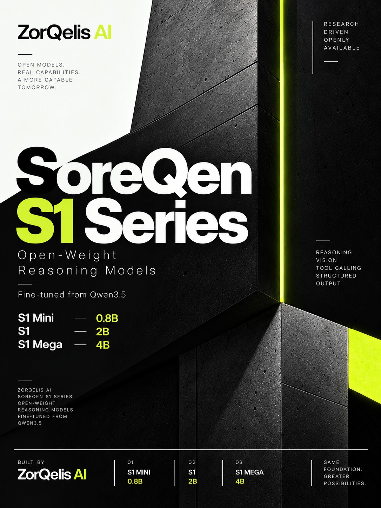

<div align="center">



# SoreQen S1 Series

**Open-weight reasoning models from ZorQelis AI.**<br>
Three sizes, one foundation: fine-tuned from Qwen3.5 for reasoning, vision, tool calling and structured output, with a 256k context window.

[](LICENSE)
[](https://huggingface.co/zorqelis-ai)
[](https://platform.soreqen.com/docs)
[](https://soreqen.com)

[Models](#the-models) · [Quickstart](#quickstart) · [Open data](#open-data) · [Evaluation](#evaluation) · [Research](#how-it-was-built) · [Website](https://zorqelisai.com)

</div>

---

## The models

| | Parameters | Base model | Weights | GGUF |
|---|---:|---|---|---|
| **SoreQen S1 Mini** | 0.8B | [Qwen3.5-0.8B](https://huggingface.co/Qwen/Qwen3.5-0.8B) | [soreqen-s1-mini](https://huggingface.co/zorqelis-ai/soreqen-s1-mini) | [soreqen-s1-mini-GGUF](https://huggingface.co/zorqelis-ai/soreqen-s1-mini-GGUF) |
| **SoreQen S1** | 2B | [Qwen3.5-2B](https://huggingface.co/Qwen/Qwen3.5-2B) | [soreqen-s1](https://huggingface.co/zorqelis-ai/soreqen-s1) | [soreqen-s1-GGUF](https://huggingface.co/zorqelis-ai/soreqen-s1-GGUF) |
| **SoreQen S1 Mega** | 4B | [Qwen3.5-4B](https://huggingface.co/Qwen/Qwen3.5-4B) | [soreqen-s1-mega](https://huggingface.co/zorqelis-ai/soreqen-s1-mega) | [soreqen-s1-mega-GGUF](https://huggingface.co/zorqelis-ai/soreqen-s1-mega-GGUF) |

**S1 names the series, not a capability tier.** All three models take the same inputs and do the same things; size trades speed and memory for quality.

| Capability | Mini | S1 | Mega |
|---|:---:|:---:|:---:|
| Step-by-step reasoning (thinking on or off) | ✓ | ✓ | ✓ |
| Vision (image input) | ✓ | ✓ | ✓ |
| Tool calling | ✓ | ✓ | ✓ |
| Structured output | ✓ | ✓ | ✓ |
| Hinglish in Roman script, plus English | ✓ | ✓ | ✓ |
| Context window | 256k | 256k | 256k |

Trained in August 2026 by ZorQelis AI, New Delhi. Weights are released under Apache 2.0, the licence of the Qwen3.5 base.

## Quickstart

There are three ways to run SoreQen S1, from zero setup to fully local.

### 1. The API

OpenAI-compatible, so existing SDKs work by changing the base URL and the key. Create a key at [platform.soreqen.com](https://platform.soreqen.com). Credit is prepaid per token, with no subscription and no monthly minimum.

```bash
curl https://soreqen.com/v1/chat/completions \
  -H "Authorization: Bearer $SOREQEN_API_KEY" \
  -H "Content-Type: application/json" \
  -d '{
    "model": "soreqen-s1",
    "messages": [{"role": "user", "content": "Explain a B-tree briefly."}]
  }'
```

```python
from openai import OpenAI

client = OpenAI(base_url="https://soreqen.com/v1", api_key="YOUR_SOREQEN_API_KEY")
reply = client.chat.completions.create(
    model="soreqen-s1-mega",
    messages=[{"role": "user", "content": "yaar laptop slow ho gaya hai, kya karu?"}],
)
print(reply.choices[0].message.content)
```

| Model ID | Input | Output |
|---|---:|---:|
| `soreqen-s1-mini` | $0.05 | $0.15 |
| `soreqen-s1` | $0.10 | $0.30 |
| `soreqen-s1-mega` | $0.25 | $0.75 |

Prices are in US dollars per million tokens. Reasoning tokens are billed as output. Full reference: [API docs](https://platform.soreqen.com/docs) and [pricing](https://platform.soreqen.com/pricing).

### 2. Transformers

The safetensors repositories hold full merged weights, vision tower included.

```python
from transformers import AutoTokenizer, AutoModelForImageTextToText

model_id = "zorqelis-ai/soreqen-s1"
tok = AutoTokenizer.from_pretrained(model_id)
model = AutoModelForImageTextToText.from_pretrained(model_id, dtype="auto", device_map="auto")

messages = [{"role": "user", "content": "Explain a B-tree briefly."}]
text = tok.apply_chat_template(
    messages, tokenize=False, add_generation_prompt=True,
    enable_thinking=True,  # False for direct answers
)
out = model.generate(**tok(text, return_tensors="pt").to(model.device), max_new_tokens=800)
print(tok.decode(out[0], skip_special_tokens=True))
```

### 3. llama.cpp and Ollama

```bash
# llama.cpp: pulls the Q4_K_M build straight from Hugging Face
llama-cli -hf zorqelis-ai/soreqen-s1-GGUF:Q4_K_M --jinja

# Ollama
ollama run hf.co/zorqelis-ai/soreqen-s1-GGUF:Q4_K_M
```

Pass `--jinja` so llama.cpp uses the packaged chat template. The GGUF builds are **text only**: the vision tower is not included, so use the safetensors weights or the API for image input.

| Download size | Q4_K_M | Q8_0 | F16 | safetensors |
|---|---:|---:|---:|---:|
| S1 Mini | 0.53 GB | 0.81 GB | 1.52 GB | 1.71 GB |
| S1 | 1.27 GB | 2.01 GB | 3.78 GB | 4.43 GB |
| S1 Mega | 2.71 GB | 4.48 GB | 8.42 GB | 9.08 GB |

Q4_K_M is the default and runs on a modest laptop. Q8_0 is near-lossless if you have the memory.

Runnable versions of these snippets are in [`examples/`](examples).

## Open data

Weights let you run a model; they do not let you check it. The training data is published too, with counts of what was thrown away and why.

| Dataset | Training rows | What was filtered out |
|---|---:|---|
| [SoreQen Hinglish](https://huggingface.co/datasets/zorqelis-ai/soreqen-hinglish) | 36,326 | 13,657 rows rejected for too little Hindi |
| [SoreQen Reasoning](https://huggingface.co/datasets/zorqelis-ai/soreqen-reasoning) | 540,175 | 6,293,545 near-duplicate rows removed |
| [SoreQen Writing](https://huggingface.co/datasets/zorqelis-ai/soreqen-writing) | 23,728 | 17,162 truncated rows discarded |
| **Total** | **600,229** | |

Sources and licences for every dataset: [zorqelisai.com/open-source](https://zorqelisai.com/open-source).

## Evaluation

One evaluation has been run and published: 24 Hinglish prompts, SoreQen S1 Mega against its Qwen3.5 4B base.

| Measure | S1 Mega | Qwen3.5 4B |
|---|:---:|:---:|
| Genuinely code-mixed answer | **20 / 24** | 15 / 24 |
| Stayed in Roman script | 24 / 24 | 24 / 24 |
| Carried sequence or cause | 23 / 24 | 24 / 24 |
| Drifted wholly into English (lower is better) | 1 / 24 | 0 / 24 |

24 prompts is a small sample, and two of the measures do not favour the fine-tune. They are reported anyway. **No public benchmark (MMLU, GSM8K, HumanEval or any leaderboard) has been run on these models**, so please do not attribute leaderboard scores to them.

## How it was built

The S1 models came out of the second of two training campaigns.

- **Campaign 1: from scratch (did not ship).** A mixture-of-experts model with 121M active of 333M total parameters, trained on 2.38 billion tokens across two RTX 5090s.
- **Campaign 2: fine-tuning Qwen3.5 (shipped as S1).** Low-rank fine-tunes at 0.8B, 2B and 4B, taught Hinglish, tool use, structured output and professional writing while keeping the base model's thinking, vision, context length and output ceiling.

The most expensive failures were silent ones: runs that completed while doing the wrong thing. The full postmortem, with forty-five recorded failures, is at [zorqelisai.com/research](https://zorqelisai.com/research).

## Where to use SoreQen

| | |
|---|---|
| **Chat** | [soreqen.com](https://soreqen.com), free to start, no account needed to try it |
| **Desktop** | [SoreQen app](https://soreqen.com/download) for Windows and Linux, with signed auto-updates |
| **API** | [platform.soreqen.com](https://platform.soreqen.com), OpenAI-compatible, prepaid per token |
| **Your hardware** | [huggingface.co/zorqelis-ai](https://huggingface.co/zorqelis-ai), safetensors and GGUF |

## Limitations

- Small models state confident numbers they cannot verify. Do not trust S1 Mini on prices, rates or arithmetic without checking.
- Hinglish output is Roman script by design; the models do not write Devanagari.
- Trained for conversation and everyday work, not for safety-critical, medical, legal or financial advice.

## Citation

```bibtex
@misc{soreqen-s1-2026,
  title        = {SoreQen S1 Series: Open-Weight Reasoning Models},
  author       = {{ZorQelis AI}},
  year         = {2026},
  howpublished = {\url{https://huggingface.co/zorqelis-ai}},
}
```

## About ZorQelis AI

ZorQelis AI is an AI research company in New Delhi, India, founded by Ved Saini. SoreQen is its model and product line.

[Website](https://zorqelisai.com) · [Blog](https://zorqelisai.com/blog) · [Hugging Face](https://huggingface.co/zorqelis-ai) · [X](https://x.com/ZorQelisAI) · [LinkedIn](https://www.linkedin.com/company/zorqelis-ai) · [Instagram](https://www.instagram.com/zorqelisai)

<sub>The code and documentation in this repository are released under the [Apache 2.0 licence](LICENSE). Model weights carry their own licence on Hugging Face (Apache 2.0).</sub>
